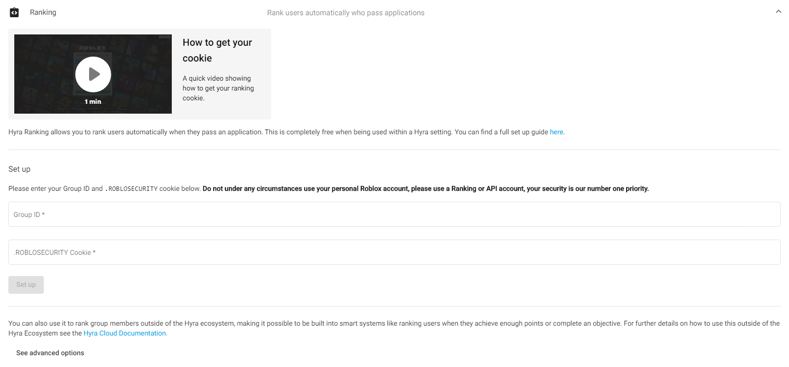

# Introduction

Hyra Ranking runs on the backbone of the powerful Campfire HQ Ranking API. This makes our ranking API:

* Scalable 
* Fast
* User-friendly

The Campfire Ranking API is one of the only highly-scalable callback based APIs for ranking on the platform. The nature of the ranking API being callback based allows you to use the API to build powerful, promise based asynchronous systems, where you always know if there was a successful update or a failed update.

## Getting started

To get started using the Hyra Ranking API, you will need to register for a Hyra Ranking token. This can be done on the Workspace admin.

You input your Group ID and your .ROBLOSECURITY cookie, and you will be supplied with a **token**

The API will allow up to 500 successful invocations per day, which resets at 05:00 AM UTC \(12:00 AM EST\).

Once you have set up your Ranking, you will use the token to interact with the API.

To see how you can use the API, please see the other pages in this section.

